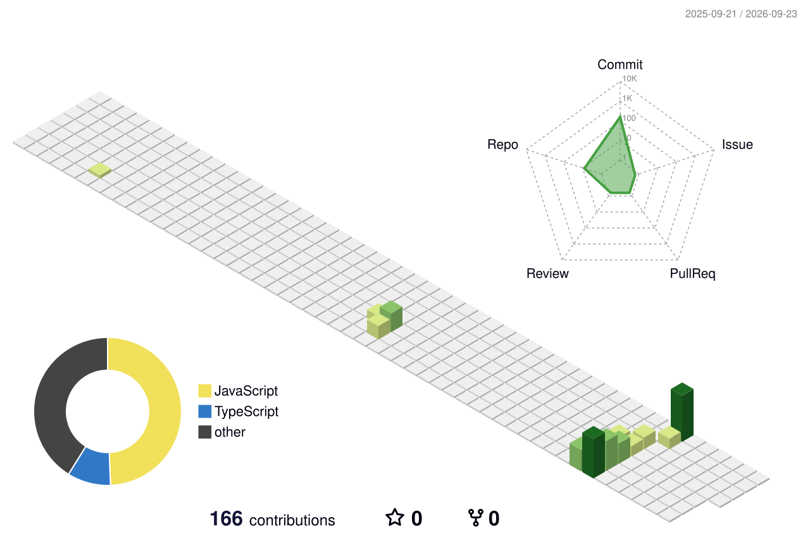

  

  
  
  

  <strong>Building software that solves real-world problems.</strong>
   
  Creating clean, practical, and scalable applications across web, mobile, and AI.

---

## 🚀 Currently Building

<table>
<tr>

<td width="50%" valign="top">

  

<h3>👕 ClosetIQ</h3>

<strong>AI-Powered Smart Wardrobe Assistant</strong>

Manage your wardrobe and discover better outfits with AI.

### ✨ Highlights

- 👕 Organize your digital wardrobe
- 🤖 AI-powered outfit recommendations
- 👔 Create and manage outfits
- 📅 Plan outfits effortlessly

### 🧰 Built With

`React Native` `Expo` `Node.js`  
`Python` `AI` `MongoDB`

### 🎯 Focus

`AI Integration` `Mobile UX` `Personalization`

</td>

<td width="50%" valign="top">

  

<h3>🧮 FormulaIQ</h3>

<strong>Math Formula Learning Companion</strong>

Making formula revision faster, simpler, and more engaging.

### ✨ Highlights

- 📚 Offline formula access
- 🃏 Interactive formula flashcards
- ⏱️ Focused study sessions
- 📊 Track learning progress

### 🧰 Built With

`React Native` `Expo` `JavaScript`  
`AsyncStorage` `Offline Storage`

### 🎯 Focus

`Offline First` `Study Tools` `Progress Tracking`

</td>

</tr>
</table>

---

## ⭐ Featured Projects

<table>
<tr>

<td width="50%" valign="top">

  

### ✂️ ClearCut

AI-powered mobile application for removing image backgrounds and generating transparent PNGs.

**Tech Stack**

`React Native` `Expo` `Node.js`  
`Python` `FastAPI` `rembg`

  
   &nbsp;&nbsp;&nbsp;&nbsp;&nbsp;&nbsp;&nbsp;&nbsp;&nbsp;&nbsp; &nbsp;&nbsp;&nbsp;&nbsp;&nbsp;&nbsp;&nbsp;&nbsp;&nbsp;&nbsp; &nbsp;&nbsp;&nbsp;&nbsp;&nbsp;&nbsp;&nbsp;&nbsp;&nbsp;&nbsp;&nbsp;&nbsp;&nbsp;&nbsp;&nbsp;&nbsp;&nbsp;&nbsp;
  <a href="https://expo.dev/accounts/mohith1532/projects/ClearCut/builds/50674834-cf1b-46d9-b2fc-3bcdace62595">Live Demo →</a>

</td>

<td width="50%" valign="top">

  

### 📚 StudyBuddy

A student-focused platform designed to help learners connect, collaborate, and find suitable study partners.

**Tech Stack**

`React` `Node.js` `Express`  
`MongoDB` `JWT`

  
  &nbsp;&nbsp;&nbsp;&nbsp;&nbsp;&nbsp;&nbsp;&nbsp;&nbsp;&nbsp; &nbsp;&nbsp;&nbsp;&nbsp;&nbsp;&nbsp;&nbsp;&nbsp;&nbsp;&nbsp; &nbsp;&nbsp;&nbsp;&nbsp;&nbsp;&nbsp;&nbsp;&nbsp;&nbsp;&nbsp;&nbsp;&nbsp;&nbsp;&nbsp;&nbsp;&nbsp;&nbsp;&nbsp;
  <a href="#">Live Demo →</a>

</td>

</tr>

<tr>

<td width="50%" valign="top">

  

### 🛍️ LocalMart

A mobile marketplace for browsing products, managing listings, and connecting buyers with sellers.

**Tech Stack**

`React Native` `Node.js`  
`Express` `MongoDB`

  
   &nbsp;&nbsp;&nbsp;&nbsp;&nbsp;&nbsp;&nbsp;&nbsp;&nbsp;&nbsp; &nbsp;&nbsp;&nbsp;&nbsp;&nbsp;&nbsp;&nbsp;&nbsp;&nbsp;&nbsp; &nbsp;&nbsp;&nbsp;&nbsp;&nbsp;&nbsp;&nbsp;&nbsp;&nbsp;&nbsp;&nbsp;&nbsp;&nbsp;&nbsp;&nbsp;&nbsp;&nbsp;&nbsp;
  <a href="#">Live Demo →</a>

</td>

<td width="50%" valign="top">

  

### 💻 Developer Portfolio

A personal developer portfolio showcasing projects, technical skills, experience, and achievements.

**Tech Stack**

`React` `JavaScript` `CSS`  
`Vercel`

  
  &nbsp;&nbsp;&nbsp;&nbsp;&nbsp;&nbsp;&nbsp;&nbsp;&nbsp;&nbsp; &nbsp;&nbsp;&nbsp;&nbsp;&nbsp;&nbsp;&nbsp;&nbsp;&nbsp;&nbsp; &nbsp;&nbsp;&nbsp;&nbsp;&nbsp;&nbsp;&nbsp;&nbsp;&nbsp;&nbsp;&nbsp;&nbsp;&nbsp;&nbsp;&nbsp;&nbsp;&nbsp;&nbsp;
  <a href="https://portfolio-mohith-reddys-projects-d7edca38.vercel.app/">Live Demo →</a>

</td>

</tr>
</table>

---

## 🛠️ Tech Stack

  <em>Technologies and tools I use to build modern, scalable applications.</em>

<table align="center">
<tr>

<td width="33%" valign="top" align="center">

### 🎨 Frontend

  
  
  
  
  

HTML5 · CSS3 · JavaScript · React · Next.js

</td>

<td width="33%" valign="top" align="center">

### ⚙️ Backend

  
  
  
  
  

Node.js · Express.js · Python · Java · Spring Boot

</td>

<td width="33%" valign="top" align="center">

### 📱 Mobile

  
  

React Native · Expo

</td>

</tr>

<tr>

<td width="33%" valign="top" align="center">

### 🗄️ Databases

  
  

MongoDB Atlas · MySQL

</td>

<td width="33%" valign="top" align="center">

### 🔧 Tools & Workflow

  
  
  
  
  

Git · GitHub · VS Code · IntelliJ IDEA · Postman

</td>

<td width="33%" valign="top" align="center">

### ☁️ DevOps & Deployment

  
  
  

Docker · Vercel · Render

</td>

</tr>

<tr>

<td colspan="3" align="center">

### 🔗 APIs & Development

  
  

REST APIs · JWT Authentication · AsyncStorage · MongoDB Atlas

</td>

</tr>
</table>

 

  

---

## 💡 What I Like Building

<table>
<tr>

<td width="33%" valign="top">

### 🌐 Web Applications

Building responsive and scalable web experiences with a focus on performance and usability.

</td>

<td width="33%" valign="top">

### 📱 Mobile Applications

Creating practical mobile experiences with clean interfaces and intuitive interactions.

</td>

<td width="33%" valign="top">

### 🤖 AI-Powered Products

Turning AI capabilities into useful products that solve real-world problems.

</td>

</tr>

<tr>

<td width="33%" valign="top">

### ⚙️ Backend Systems

Designing reliable APIs, authentication systems, databases, and service integrations.

</td>

<td width="33%" valign="top">

### 🎨 UI & UX

Creating simple, thoughtful interfaces with smooth interactions and attention to detail.

</td>

<td width="33%" valign="top">

### 🚀 Developer Tools

Building useful tools and applications that simplify everyday tasks and workflows.

</td>

</tr>
</table>

---

## 🏆 Achievements

- 🏆 **Best Implementation Award** — GDG Hackathon 2025
- **350+ Problems Solved** — LeetCode & GeeksforGeeks
  
---

## 📊 GitHub Stats

  

---

## 📈 Contribution Graph

  

---

## 🎯 2026 Goals

| Status | Goal |
|:---:|---|
| ✓ | Build and ship production-ready applications |
| ✓ | Strengthen Full Stack Development skills |
| ✓ | Build and deploy mobile applications |
| ☐ | Contribute to Open Source |
| ☐ | Build more AI-powered products |
| ☐ | Strengthen DSA fundamentals |
| ☐ | Grow as a Software Engineer |

---

## 🤝 Let's Connect

  
  &nbsp;&nbsp;
  
  &nbsp;&nbsp;
  

  Let's connect, collaborate on ideas, and build useful software together.
   
  Always open to new opportunities, interesting projects, and meaningful collaborations.

