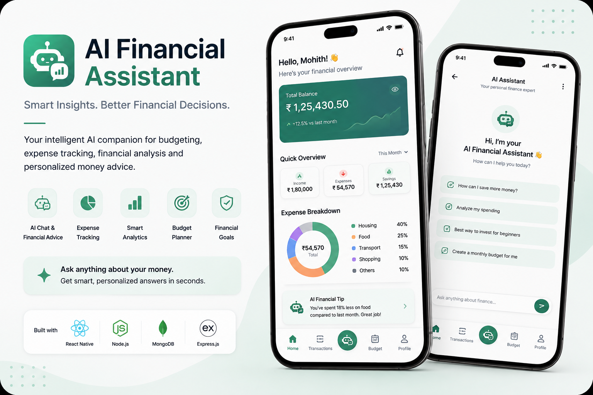

<!-- ========================================================= -->
<!--                     HERO BANNER                           -->
<!-- ========================================================= -->

  

  

  

  

  

---

# 👋 About Me

I'm **Mohith Reddy**, a passionate **Full Stack Developer** who loves building products that solve real-world problems.

I enjoy creating modern **mobile apps**, **web applications**, and **AI-powered platforms** with clean UI, scalable architecture, and great user experience.

Currently I'm focused on

- 📱 React Native Development
- 🌐 MERN Stack
- 🤖 AI Applications
- ⚡ Backend Engineering
- ☁️ Scalable APIs
- 📚 DSA & System Design

---

# 🛠 Tech Stack

## Languages

## Frontend

## Mobile

React Native • Expo

## Backend

## Database

## Tools

# 🚀 Project Showcase

  <i>Some of the products I've designed and developed with a focus on user experience, performance, and scalability.</i>

---

<table>
<tr>

<td width="55%" valign="top">

# 👔 ClosetIQ

### AI-Powered Digital Wardrobe

ClosetIQ is an intelligent wardrobe management platform that helps users organize clothing, build outfits, receive AI recommendations, and gain wardrobe insights.

### ✨ Highlights

- 🤖 AI Outfit Recommendations
- 👕 Smart Digital Closet
- 📅 Outfit Planner
- 📊 Wardrobe Analytics
- ❤️ Favorites
- 🎯 Outfit Builder

### 🛠 Tech Stack

`React Native` • `Node.js` • `Express` • `MongoDB`

 

</td>

<td width="45%" align="center">

</td>

</tr>
</table>

---

<table>
<tr>

<td width="45%" align="center">

</td>

<td width="55%" valign="top">

# 📘 FormulaIQ

### Smart Formula Handbook

FormulaIQ is a beautifully designed learning companion that provides quick access to mathematical formulas with powerful search and organized chapters.

### ✨ Highlights

- 📚 500+ Formulas
- 🔍 Smart Search
- ⭐ Favorites
- 📖 Category-wise Learning
- 📱 Offline Support

### 🛠 Tech Stack

`React Native` • `Expo` • `AsyncStorage`

 

</td>

</tr>
</table>

---

<table>
<tr>

<td width="55%" valign="top">

# 🤖 AI Financial Assistant

### AI-Powered Investment Companion

An intelligent finance platform that helps users understand investing, analyze portfolios, chat with AI, and improve financial literacy.

### ✨ Highlights

- 🤖 AI Chat Assistant
- 📈 Portfolio Analysis
- 💰 Investment Recommendations
- 📚 Financial Education
- 📊 Smart Dashboard

### 🛠 Tech Stack

`React` • `Node.js` • `MongoDB` • `OpenAI`

 

</td>

<td width="45%" align="center">

</td>

</tr>
</table>

---

<table>
<tr>

<td width="45%" align="center">

</td>

<td width="55%" valign="top">

# 🎓 Study Buddy

### Collaborative Learning Platform

A full-stack web platform where students can connect, collaborate, discover study partners, and share educational resources.

### ✨ Highlights

- 👥 Student Community
- 📝 Discussion Boards
- 📚 Resource Sharing
- 🤝 Study Groups
- 🔍 Smart Discovery

### 🛠 Tech Stack

`React` • `Node.js` • `Express` • `MongoDB`

 

</td>

</tr>
</table>

---
# 📊 GitHub Analytics

---

# 🏆 GitHub Trophies

---

# 💻 Coding Profiles

---

# 🚧 Currently Building

- 👔 ClosetIQ v2
- 🤖 AI Financial Assistant
- 📘 FormulaIQ
- ⚡ AI Automation Workflows
- 🌐 Modern Full Stack Applications

---

# 📫 Let's Connect

---

> **"Build products that solve real problems, and let your work speak for you."**

⭐ Thanks for visiting my profile!

