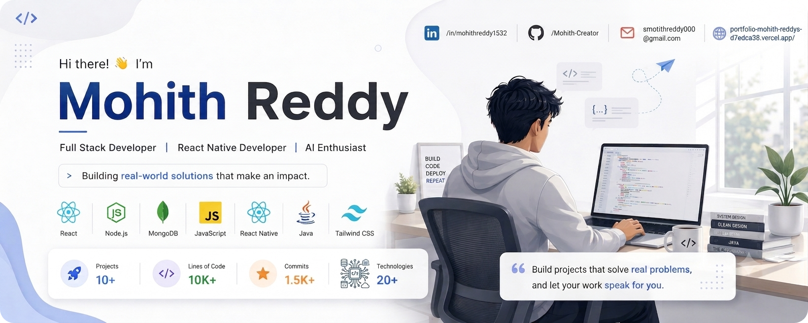

<p align="center">
  
</p>

---

## 🔨 Currently Building

### 🪄 ClearCut

**AI Background Removal Application**

A mobile application that allows users to upload an image, automatically remove its background using AI, preview the result, and save the processed PNG.

**Tech Stack**

`React Native` `Expo` `Node.js` `Python` `FastAPI` `rembg`

### 🧮 FormulaIQ

**Math Formula Learning Companion**

A mobile learning application designed to help students quickly revise important mathematical formulas with offline access, flashcards, study sessions, and progress tracking.

**Tech Stack**

`React Native` `Expo` `JavaScript` `AsyncStorage`

---

## ⭐ Featured Projects

### 🪄 ClearCut
AI-powered background removal mobile application built with React Native and a Python-based image processing service.

### 🧮 FormulaIQ
Offline-first formula revision companion designed for quick mathematical revision and study tracking.

### 👕 ClosetIQ
AI-powered smart wardrobe assistant for organizing clothing, creating outfits, and getting personalized recommendations.

### 💰 FinTrack
Expense tracking application focused on helping users monitor spending and manage personal finances.

### 🛍️ LocalMart
Mobile marketplace application built with React Native, Node.js, and MongoDB.

---

## 🛠️ Tech Stack

### Frontend

<p>
  
</p>

### Backend

<p>
  
</p>

### Mobile Development

<p>
  
</p>

### Databases

<p>
  
</p>

### Tools & Platforms

<p>
  
</p>

---

## 💡 What I Like Building

### 🌐 Web Apps
Modern, responsive and scalable web experiences.

### 📱 Mobile Apps
Practical applications with clean and intuitive interfaces.

### 🤖 AI Products
Real-world applications powered by AI and automation.

### ⚙️ Backend Systems
REST APIs, authentication, databases and third-party integrations.

### 🎨 UI/UX
Clean interfaces with thoughtful user experiences and smooth interactions.

### 🚀 Developer Projects
Useful tools and applications that solve everyday problems.

---

## 🏆 Achievements

- 🏆 **Best Implementation Award** — GDG Hackathon 2025
- 🎓 **B.Tech in Computer Science** — SRKR Engineering College
- 💻 Built multiple full-stack, AI-powered and mobile applications
- 🚀 Experience across React, React Native, Node.js, Python and Java

---

## 📊 GitHub Stats

<p align="center">
  
  
</p>

---

## 📈 Contribution Graph

<p align="center">
  
</p>

---

## 🎯 2026 Goals

```text
☑ Complete B.Tech in Computer Science
☑ Build production-ready applications
☑ Strengthen Full Stack Development skills
☑ Build and deploy mobile applications

☐ Contribute to Open Source
☐ Build more AI-powered products
☐ Improve System Design skills
☐ Strengthen DSA fundamentals
☐ Grow as a Software Engineer
```

---

## 📚 Currently Learning

```text
→ Data Structures & Algorithms
→ System Design
→ Advanced React & Next.js
→ Backend Architecture
→ Cloud & Deployment
→ AI-powered Application Development
```

---

## 🤝 Let's Connect

<p align="center">
  <a href="https://www.linkedin.com/in/mohithreddy1532">
    
  </a>
  <a href="https://github.com/Mohith-Creator">
    
  </a>
  <a href="mailto:smohithreddy000@gmail.com">
    
  </a>
  <a href="https://portfolio-mohith-reddys-d7edca38.vercel.app/">
    
  </a>
</p>

<p align="center">
  <i>Build projects that solve real problems, and let your work speak for you.</i>
</p>
