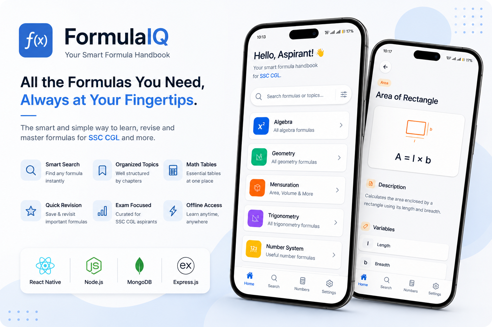
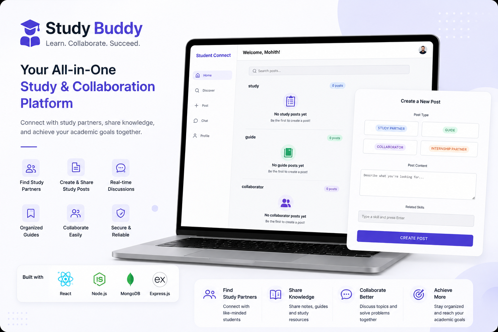
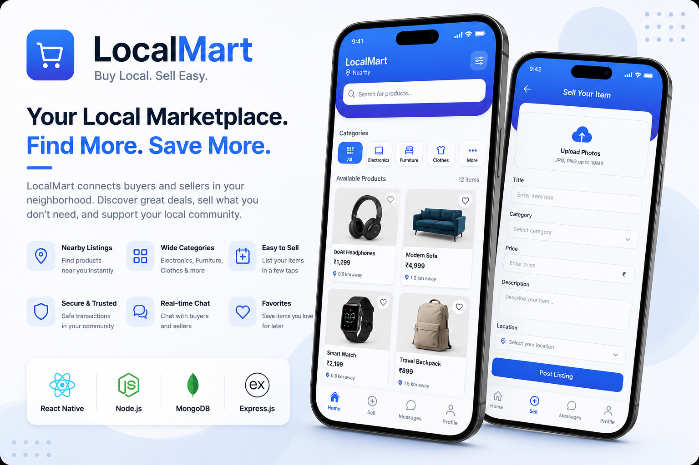
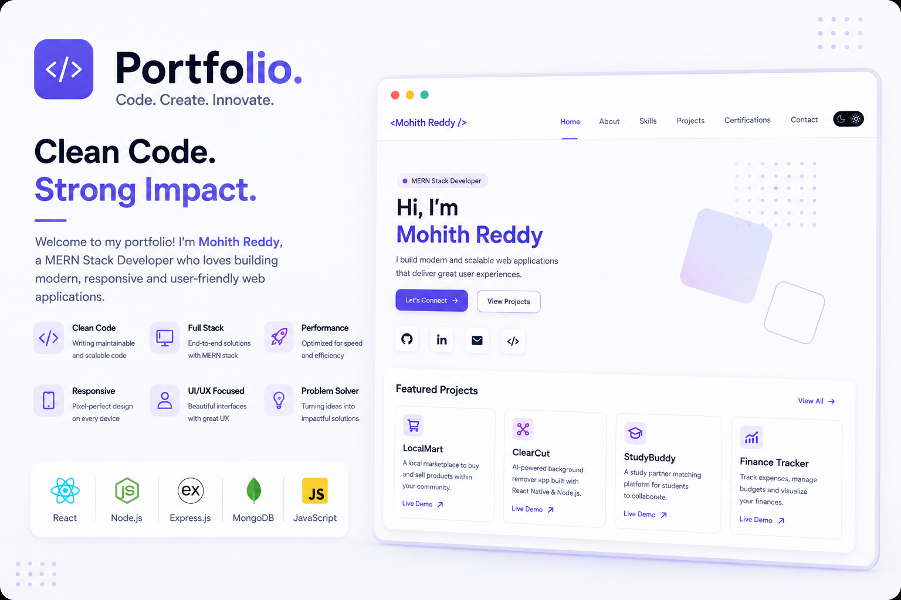

<p align="center">
  
</p>

<p align="center">
  <a href="https://github.com/Mohith-Creator">
    
  </a>
  <a href="https://www.linkedin.com/in/mohithreddy1532">
    
  </a>
  <a href="mailto:smohithreddy000@gmail.com">
    
  </a>
</p>

<p align="center">
  <strong>Building software that solves real-world problems.</strong>
  <br/>
  Creating clean, practical, and scalable applications across web, mobile, and AI.
</p>

---

## 🚀 Currently Building

<table>
<tr>

<td width="50%" valign="top">

<p align="left">
  
</p>

<h3>👕 ClosetIQ</h3>

<strong>AI-Powered Smart Wardrobe Assistant</strong>

Manage your wardrobe and discover better outfits with AI.

### ✨ Highlights

- 👕 Organize your digital wardrobe
- 🤖 AI-powered outfit recommendations
- 👔 Create and manage outfits
- 📅 Plan outfits effortlessly

### 🧰 Built With

`React Native` `Expo` `Node.js`  
`Python` `AI` `MongoDB`

### 🎯 Focus

`AI Integration` `Mobile UX` `Personalization`

</td>

<td width="50%" valign="top">

<p align="left">
  
</p>

<h3>🧮 FormulaIQ</h3>

<strong>Math Formula Learning Companion</strong>

Making formula revision faster, simpler, and more engaging.

### ✨ Highlights

- 📚 Offline formula access
- 🃏 Interactive formula flashcards
- ⏱️ Focused study sessions
- 📊 Track learning progress

### 🧰 Built With

`React Native` `Expo` `JavaScript`  
`AsyncStorage` `Offline Storage`

### 🎯 Focus

`Offline First` `Study Tools` `Progress Tracking`

</td>

</tr>
</table>

---

## ⭐ Featured Projects

<table>
<tr>

<td width="50%" valign="top">

<p align="left">
  
</p>

### ✂️ ClearCut

AI-powered mobile application for removing image backgrounds and generating transparent PNGs.

**Tech Stack**

`React Native` `Expo` `Node.js`  
`Python` `FastAPI` `rembg`

<p>
  <a href="https://github.com/Mohith-Creator/ClearCut-mobile">
    
  </a>
  <span> &nbsp;&nbsp;&nbsp;&nbsp;&nbsp;&nbsp;&nbsp;&nbsp;&nbsp;&nbsp; &nbsp;&nbsp;&nbsp;&nbsp;&nbsp;&nbsp;&nbsp;&nbsp;&nbsp;&nbsp; &nbsp;&nbsp;&nbsp;&nbsp;&nbsp;&nbsp;&nbsp;&nbsp;&nbsp;&nbsp;</span>
  <a href="https://expo.dev/accounts/mohith1532/projects/ClearCut/builds/50674834-cf1b-46d9-b2fc-3bcdace62595">Live Demo →</a>
</p>

</td>

<td width="50%" valign="top">

<p align="left">
  
</p>

### 📚 StudyBuddy

A student-focused platform designed to help learners connect, collaborate, and find suitable study partners.

**Tech Stack**

`React` `Node.js` `Express`  
`MongoDB` `JWT`

<p>
  <a href="https://github.com/Mohith-Creator/studybuddy">
    
  </a>
 <span> &nbsp;&nbsp;&nbsp;&nbsp;&nbsp;&nbsp;&nbsp;&nbsp;&nbsp;&nbsp; &nbsp;&nbsp;&nbsp;&nbsp;&nbsp;&nbsp;&nbsp;&nbsp;&nbsp;&nbsp; &nbsp;&nbsp;&nbsp;&nbsp;&nbsp;&nbsp;&nbsp;&nbsp;&nbsp;&nbsp;</span>
  <a href="#">Live Demo →</a>
</p>

</td>

</tr>

<tr>

<td width="50%" valign="top">

<p align="left">
  
</p>

### 🛍️ LocalMart

A mobile marketplace for browsing products, managing listings, and connecting buyers with sellers.

**Tech Stack**

`React Native` `Node.js`  
`Express` `MongoDB`

<p>
  <a href="https://github.com/Mohith-Creator/LocalMart">
    
  </a>
  <span> &nbsp;&nbsp;&nbsp;&nbsp;&nbsp;&nbsp;&nbsp;&nbsp;&nbsp;&nbsp; &nbsp;&nbsp;&nbsp;&nbsp;&nbsp;&nbsp;&nbsp;&nbsp;&nbsp;&nbsp; &nbsp;&nbsp;&nbsp;&nbsp;&nbsp;&nbsp;&nbsp;&nbsp;&nbsp;&nbsp;</span>
  <a href="#">Live Demo →</a>
</p>

</td>

<td width="50%" valign="top">

<p align="left">
  
</p>

### 💻 Developer Portfolio

A personal developer portfolio showcasing projects, technical skills, experience, and achievements.

**Tech Stack**

`React` `JavaScript` `CSS`  
`Vercel`

<p>
  <a href="https://github.com/Mohith-Creator/portfolio">
    
  </a>
 <span> &nbsp;&nbsp;&nbsp;&nbsp;&nbsp;&nbsp;&nbsp;&nbsp;&nbsp;&nbsp; &nbsp;&nbsp;&nbsp;&nbsp;&nbsp;&nbsp;&nbsp;&nbsp;&nbsp;&nbsp; &nbsp;&nbsp;&nbsp;&nbsp;&nbsp;&nbsp;&nbsp;&nbsp;&nbsp;&nbsp;</span>
  <a href="https://portfolio-mohith-reddys-projects-d7edca38.vercel.app/">Live Demo →</a>
</p>

</td>

</tr>
</table>

---

## 🛠️ Tech Stack

<table>
<tr>

<td width="25%" valign="top">

### Frontend

| | Technology |
|---|---|
|  | **HTML5** |
|  | **CSS3** |
|  | **JavaScript** |
|  | **React** |
|  | **Next.js** |

</td>

<td width="25%" valign="top">

### Mobile

| | Technology |
|---|---|
|  | **React Native** |
|  | **Expo** |

</td>

<td width="25%" valign="top">

### Backend

| | Technology |
|---|---|
|  | **Node.js** |
|  | **Express.js** |
|  | **Python** |
|  | **Java** |
|  | **Spring Boot** |

</td>

<td width="25%" valign="top">

### Databases

| | Technology |
|---|---|
|  | **MongoDB** |
|  | **MySQL** |

</td>

</tr>

<tr>

<td width="25%" valign="top">

### Tools

| | Technology |
|---|---|
|  | **Git** |
|  | **GitHub** |
|  | **VS Code** |
|  | **IntelliJ IDEA** |

</td>

<td width="25%" valign="top">

### Development

| | Technology |
|---|---|
|  | **Postman** |
|  | **Docker** |
|  | **Vercel** |
|  | **Render** |

</td>

<td width="25%" valign="top">

### APIs & Services

| | Technology |
|---|---|
| | **REST APIs** |
| | **JWT** |
| | **AsyncStorage** |
| | **MongoDB Atlas** |

</td>

</tr>
</table>

---

## 💡 What I Like Building

<table>
<tr>

<td width="33%" valign="top">

### 🌐 Web Applications

Building responsive and scalable web experiences with a focus on performance and usability.

</td>

<td width="33%" valign="top">

### 📱 Mobile Applications

Creating practical mobile experiences with clean interfaces and intuitive interactions.

</td>

<td width="33%" valign="top">

### 🤖 AI-Powered Products

Turning AI capabilities into useful products that solve real-world problems.

</td>

</tr>

<tr>

<td width="33%" valign="top">

### ⚙️ Backend Systems

Designing reliable APIs, authentication systems, databases, and service integrations.

</td>

<td width="33%" valign="top">

### 🎨 UI & UX

Creating simple, thoughtful interfaces with smooth interactions and attention to detail.

</td>

<td width="33%" valign="top">

### 🚀 Developer Tools

Building useful tools and applications that simplify everyday tasks and workflows.

</td>

</tr>
</table>

---

## 🏆 Achievements

- 🏆 **Best Implementation Award** — GDG Hackathon 2025
- **350+ Problems Solved** — LeetCode & GeeksforGeeks
  
---

## 📊 GitHub Stats

<p align="center">
  
  
</p>

---

## 📈 Contribution Graph

<p align="center">
  
</p>

---

## 🎯 2026 Goals

```text
☑ Complete B.Tech in Computer Science
☑ Build production-ready applications
☑ Strengthen Full Stack Development skills
☑ Build and deploy mobile applications

☐ Contribute to Open Source
☐ Build more AI-powered products
☐ Improve System Design skills
☐ Strengthen DSA fundamentals
☐ Grow as a Software Engineer
```

---

## 📚 Currently Learning

```text
→ Data Structures & Algorithms
→ System Design
→ Advanced React & Next.js
→ Backend Architecture
→ Cloud & Deployment
→ AI-powered Application Development
```

---

## 🤝 Let's Connect

<p align="center">
  <a href="https://www.linkedin.com/in/mohithreddy1532">
    
  </a>
  <a href="https://github.com/Mohith-Creator">
    
  </a>
  <a href="mailto:smohithreddy000@gmail.com">
    
  </a>
  <a href="https://portfolio-mohith-reddys-d7edca38.vercel.app/">
    
  </a>
</p>

<p align="center">
  <i>Build projects that solve real problems, and let your work speak for you.</i>
</p>
